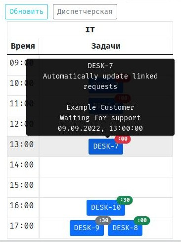
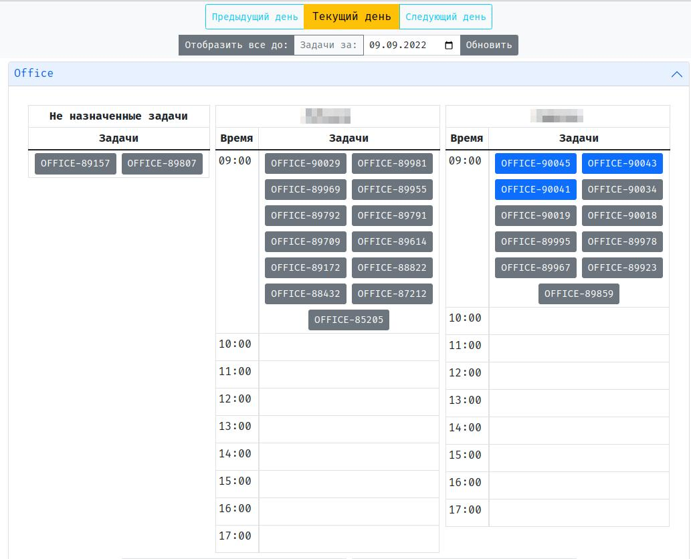
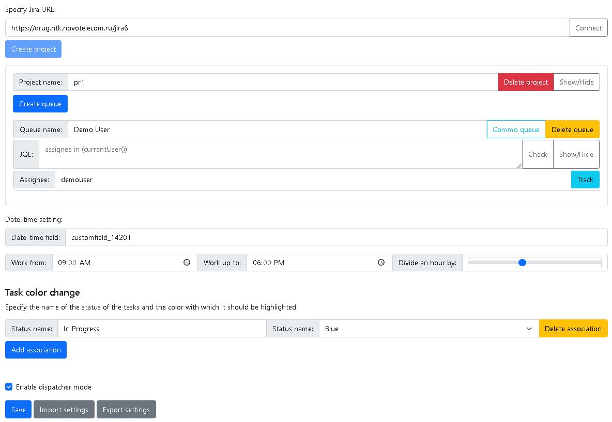

# Жирафик | Jirafee
Расширение браузера Google Chrome для отображения и распределения задач Jira по времени, исполнителям.

Google Chrome browser extension for displaying and distributing Jira issues by time, assignee.

Всплывающее уведомление | Popup window:

Режим диспетчера | Dispatcher mode:

Настройки | Settings:

## Функционал:
1. Запрашивает задачи из Jira по JQL, позволяя гибко формировать очереди исполнителей.
2. Очереди группируются в Проекты - для просмотра и управления несколькими подразделениями.
3. Распределение задач по часам и по минутам. Часы отображаются в виде списка, а минуты - в виде части от часа, маленькой меткой на самой задаче, меняющей свой цвет в зависимости от текущего времени.
4. Задачи можно переносить между очередями, меняя им исполителя и время одновременно.
5. При наведении курсора на задачу - появляется краткое описание задачи.
6. Получение уведомлений в браузере для отслеживаемых очередей.
7. Режим Диспетчера для просмотра всех очередей одновременно, фильтрации задач по дням, получение уведомлений из всех общих очередей.
8. Импорт и экспорт настроек через JSON. Синхронизации через Google аккаунт к сожалению нет, поскольку все данные хранятся в одной кучке. Но если разделить, в будущем можно реализовать и синхронизацию настроек.

## Functional:
1. Requests tasks from Jira using JQL, allowing you to flexibly form queues of performers.
2. Queues are grouped into Projects - for viewing and managing multiple departments.
3. Distribution of tasks by hours and minutes. Hours are displayed as a list, and minutes are displayed as part of the hour, with a small label on the task itself that changes color depending on the current time.
4. Tasks can be transferred between queues, changing their executor and time at the same time.
5. When you hover over a task, a brief description of the task appears.
6. Receive browser notifications for monitored queues.
7. Dispatcher mode for viewing all queues at the same time, filtering tasks by day, receiving notifications from all common queues.
8. Import and export settings via JSON. Unfortunately, there is no synchronization through a Google account, since all data is stored in one pile. But if you separate it, you can implement synchronization of settings in the future.

## Wiki
Для настройки проекта Jira и расширения, прошу [перейти на Wiki](https://github.com/GrimAnEye/Jiraffe/wiki/).
To set up a Jira project and extension, please [go to the Wiki](https://github.com/GrimAnEye/Jiraffe/wiki/).
